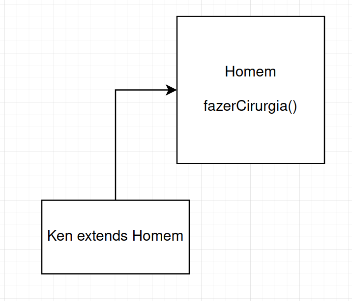
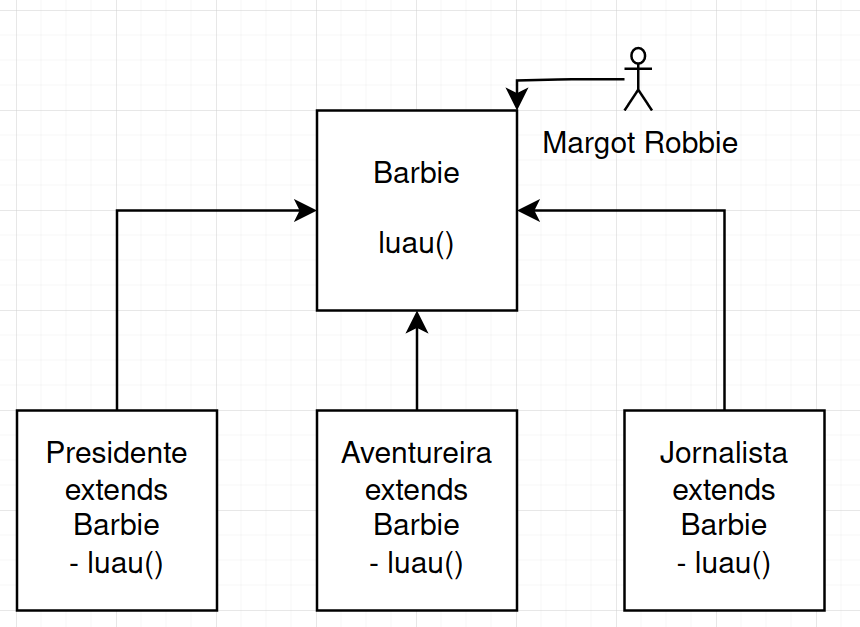

# 10.4 Princípio da Substituição de Liskov

## Definição

> Derived classes must be substitutable for their base classes.

Se uma classe é filha de outra classe, deve ser possível usar uma instância da filha no lugar de uma instância da mãe.

## Por que fazer

- Aumentar a consistência entre os contratos diminui os bugs;
- Menos tempo para aprender o código;
- Maior previsibilidade nos comportamentos implementados.

## Quando usar

- Sempre que existir um caso de especialização no seu código.

## Errado

## Certo

## Exemplo

Como aplicar a substituição de Liskov nos nossos filmes e jogos?
