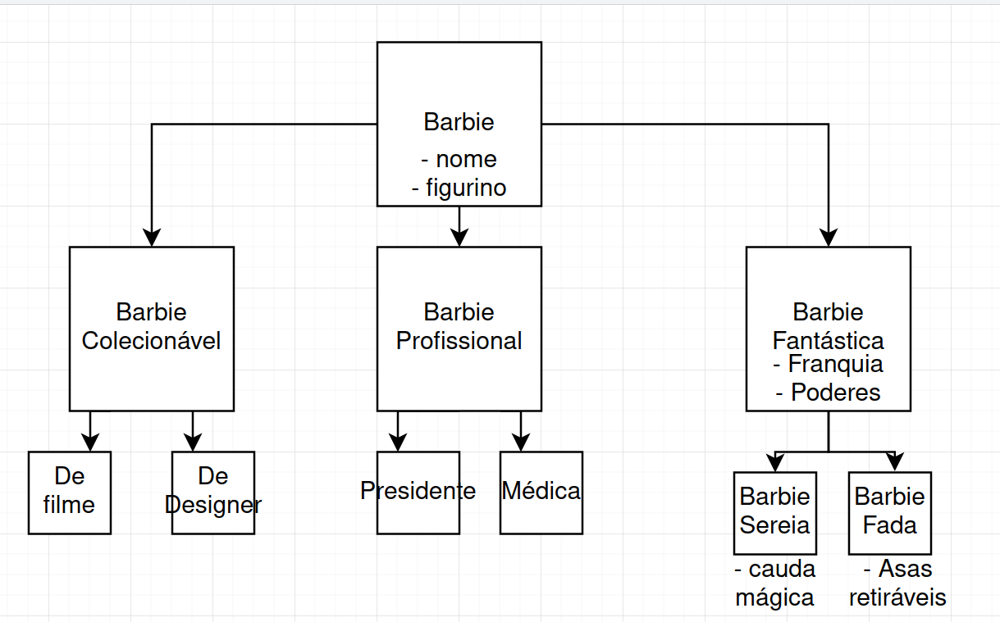

# 10.5 Princípio da segregação de interface

## Definição

> Make fine grained interfaces that are client specific.

Nenhuma propriedade deve ser herdada se não é usada, e nenhuma classe deve ser obrigada a implementar algo que ela não usa.

## Por que fazer

- Barra código morto;
- Acende o alerta para Blobs e espaguetes.

## Quando usar

- Sempre que herança estiver envolvida.

## Errado

## Certo

## Exemplo

O que filmes e jogos tem em comum?
